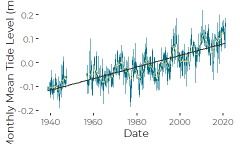
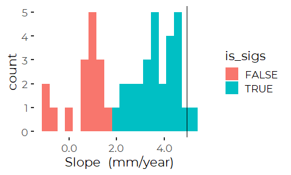
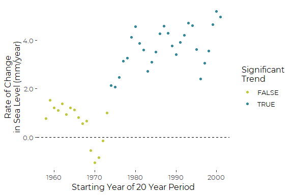

Analysis of Recent Sea Level Rise Trends at Providence, RI
================
Curtis C. Bohlen
March 31, 2021

-   [Introduction](#introduction)
-   [Import Libraries](#import-libraries)
-   [Import Data](#import-data)
-   [Estimating the Linear Trend](#estimating-the-linear-trend)
-   [Mimic the NOAA Graphic](#mimic-the-noaa-graphic)
    -   [In Meters](#in-meters)
-   [Reanalysis](#reanalysis)
    -   [Generate Cutpoints](#generate-cutpoints)
    -   [ANCOVA Model](#ancova-model)
    -   [Piecewise Linear Regression](#piecewise-linear-regression)
    -   [Visualizing the Models](#visualizing-the-models)
    -   [Cleanup](#cleanup)
-   [All Periods of A Given Span](#all-periods-of-a-given-span)
    -   [Cleanup](#cleanup-1)


# Introduction

Here we determine whether the data from the Providence Tide Gage
supports the idea that local sea level increases are accelerating.

# Import Libraries

``` r
library(tidyverse)
#> -- Attaching packages --------------------------------------- tidyverse 1.3.0 --
#> v ggplot2 3.3.3     v purrr   0.3.4
#> v tibble  3.0.5     v dplyr   1.0.3
#> v tidyr   1.1.2     v stringr 1.4.0
#> v readr   1.4.0     v forcats 0.5.0
#> -- Conflicts ------------------------------------------ tidyverse_conflicts() --
#> x dplyr::filter() masks stats::filter()
#> x dplyr::lag()    masks stats::lag()
library(readr)

library(zoo)     # for the rollmean function
#> 
#> Attaching package: 'zoo'
#> The following objects are masked from 'package:base':
#> 
#>     as.Date, as.Date.numeric

library(nlme)    # for gls
#> 
#> Attaching package: 'nlme'
#> The following object is masked from 'package:dplyr':
#> 
#>     collapse

library(CBEPgraphics)
load_cbep_fonts()
theme_set(theme_cbep())
```

# Import Data

Our primary source data is based on NOAA’s analysis of sea level trends.
The description on the source web site
(<https://tidesandcurrents.noaa.gov/sltrends/sltrends_station.shtml?id=8418150>)
says the following, so this is apparently NOT raw data.

> “The plot shows the monthly mean sea level without the regular
> seasonal fluctuations due to coastal ocean temperatures, salinities,
> winds, atmospheric pressures, and ocean currents. … The plotted values
> are relative to the most recent Mean Sea Level datum established by
> CO-OPS.”

``` r
sibfldnm <- 'Original_Data'
parent <- dirname(getwd())
sibling <- file.path(parent,sibfldnm)

dir.create(file.path(getwd(), 'figures'), showWarnings = FALSE)
```

The following generates many warnings about parsing errors, but all data
appears to be correctly imported.

``` r
fn <- '8454000_meantrend.csv'

fpath <- file.path(sibling, fn)

slr_data  <- read_csv(fpath, 
    col_types = cols(Year   = col_integer(),
                     Month = col_integer(),
                     Monthly_MSL = col_double(),
                     Linear_Trend = col_double(),
                     High_Conf.  = col_double(),
                     Low_Conf.  = col_double()
                     )) %>%
  rename(MSL = Monthly_MSL) %>%
  mutate(theDate = as.Date(paste0(Year,'/', Month,'/',15)),
         before = Year < 1956) %>%
  mutate(MSL_ft = MSL *  3.28084)
#> Warning: 868 parsing failures.
#> row col  expected    actual                                                                                                file
#>   1  -- 6 columns 7 columns 'C:/Users/curtis.bohlen/Documents/Data Analysis/Providence-SLR/Original_Data/8454000_meantrend.csv'
#>   2  -- 6 columns 7 columns 'C:/Users/curtis.bohlen/Documents/Data Analysis/Providence-SLR/Original_Data/8454000_meantrend.csv'
#>   3  -- 6 columns 7 columns 'C:/Users/curtis.bohlen/Documents/Data Analysis/Providence-SLR/Original_Data/8454000_meantrend.csv'
#>   4  -- 6 columns 7 columns 'C:/Users/curtis.bohlen/Documents/Data Analysis/Providence-SLR/Original_Data/8454000_meantrend.csv'
#>   5  -- 6 columns 7 columns 'C:/Users/curtis.bohlen/Documents/Data Analysis/Providence-SLR/Original_Data/8454000_meantrend.csv'
#> ... ... ......... ......... ...................................................................................................
#> See problems(...) for more details.
```

# Estimating the Linear Trend

We use a linear model analysis to compare results to the linear trend
reported by NOAA on the source web page. NOAA reports the rate of sea
level rise in millimeters as 1.9 ± 0.14*m**m*/*y**r*.

The NOAA data are reported monthly, but to take advantage of the Date
class in R, we expressed monthly data as relating to the fifteenth of
each month.

As a result, our model coefficients are expressed in units per DAY. To
find the relevant annual rate of sea level rise, we would need to
multiply both estimate (slope) and its standard error by 365.25
(approximate length of a year in days) and then multiply again by 1000
to convert from meters to millimeters.

We don’t bother to do that here. Results match the NOAA reported SLR
rate, if you appropriately convert units.

The estimate, even from a simple linear model matches NOAA’s reported
estimate, but the standard error and derived 95% confidence interval are
considerably narrower. NOAA appropriately treated this as an
auto-correlated time series, instead of simply fitting a least squares
linear model. We do the same, specifying and autoregressive error
function of order 1.

``` r
the_gls <- gls(MSL~theDate, data=slr_data,
               correlation = corAR1(), method = 'ML')
summary(the_gls)
#> Generalized least squares fit by maximum likelihood
#>   Model: MSL ~ theDate 
#>   Data: slr_data 
#>         AIC       BIC   logLik
#>   -3097.747 -3078.682 1552.874
#> 
#> Correlation Structure: AR(1)
#>  Formula: ~1 
#>  Parameter estimate(s):
#>       Phi 
#> 0.5024029 
#> 
#> Coefficients:
#>                   Value   Std.Error   t-value p-value
#> (Intercept) -0.04176793 0.003197184 -13.06397       0
#> theDate      0.00000661 0.000000328  20.12372       0
#> 
#>  Correlation: 
#>         (Intr)
#> theDate -0.506
#> 
#> Standardized residuals:
#>         Min          Q1         Med          Q3         Max 
#> -3.40051634 -0.62319734  0.02244842  0.60503138  3.66208094 
#> 
#> Residual standard error: 0.04676213 
#> Degrees of freedom: 868 total; 866 residual
```

Those results match the NOAA-reported estimate and 95% confidence
interval, once units are appropriately converted. (Not shown).

# Mimic the NOAA Graphic

This a redrawing of the NOAA “Mean Sea Level Trend” graphic for
Providence. I have added a 24 month (2 year) moving average, to help
visualize temporal patterns.

## In Meters

``` r
ggplot(slr_data, aes(theDate, MSL)) +
  geom_line(aes(group = before), color=cbep_colors()[1]) +
  geom_line(aes(y=rollmean(MSL,24, na.pad=TRUE), group = before), color=cbep_colors()[2]) +
  geom_smooth(method='lm', se=FALSE, color=cbep_colors()[3]) + 
  theme_cbep() + xlab('Date') + ylab('Monthly Mean Tide Level (m, MSL)')
#> `geom_smooth()` using formula 'y ~ x'
#> Warning: Removed 23 row(s) containing missing values (geom_path).
```



# Reanalysis

We want to determine if the slope observed over the last ten, fifteen,
twenty, or twenty five years is statistically different from the long
term trend or not.

We explore several concepts of what might constitute a significant
difference is this setting. We focus on examining the most recent 20
years, then explore other time scales.

1.  An ANCOVA-like model in which we can fit different slopes and
    intercepts above and below a “cutpoint.”

2.  A piecewise linear analysis, in which we fit two slopes, but
    constrain the solution to be continuous at the cutpoint (known here
    as a “knot”).

3.  Examining recent slopes in the context of all slopes over similar
    length periods over the period or record.

### Generate Cutpoints

We use these in the first two models.

``` r
span = 20
cutyear = 2019 - span

cutdate <- as.Date(paste0(cutyear, '-12-31'), format = '%Y-%m-%d')

slr_data <- slr_data %>%
  mutate(recent = Year > cutyear,
         older_date = if_else(! recent, theDate, as.Date(0)),
         recent_date = if_else(recent, theDate, as.Date(0)),
         recent_dt = if_else(recent, theDate - cutdate, 0))
```

## ANCOVA Model

Note that the default parameterization fits an intercept and a slope for
the reference level of the fitted factor (here, `recent == FALSE`) and
then fits corrections for slope and intercept for any other values of
the factor. So, the four parameters of the model (in order) are:  
\* intercept  
\* correction to intercept for most recent period  
\* slope  
\* correction to slope for most recent period.

The intercepts should not be interpreted directly, as they are for
`theDate == 0`, which in this context is meaningless.

``` r
ancova_gls <- gls(MSL~recent*theDate, data=slr_data,
                  correlation = corAR1(), method = 'ML')
summary(ancova_gls)
#> Generalized least squares fit by maximum likelihood
#>   Model: MSL ~ recent * theDate 
#>   Data: slr_data 
#>        AIC       BIC   logLik
#>   -3119.35 -3090.753 1565.675
#> 
#> Correlation Structure: AR(1)
#>  Formula: ~1 
#>  Parameter estimate(s):
#>       Phi 
#> 0.4603194 
#> 
#> Coefficients:
#>                          Value   Std.Error    t-value p-value
#> (Intercept)        -0.04351993 0.003003700 -14.488772   0e+00
#> recentTRUE         -0.11034046 0.031033842  -3.555488   4e-04
#> theDate             0.00000518 0.000000463  11.206287   0e+00
#> recentTRUE:theDate  0.00000950 0.000002123   4.473016   0e+00
#> 
#>  Correlation: 
#>                    (Intr) rcTRUE theDat
#> recentTRUE         -0.091              
#> theDate            -0.142  0.025       
#> recentTRUE:theDate  0.026 -0.964 -0.228
#> 
#> Standardized residuals:
#>         Min          Q1         Med          Q3         Max 
#> -3.53089419 -0.57030311 -0.03151618  0.57231549  3.92791482 
#> 
#> Residual standard error: 0.0448789 
#> Degrees of freedom: 868 total; 864 residual
```

Here, I pull the two slope parameters, and calculate the proportionate
change in slope implied by the model. As the fourth term is a
CORRECTION, the implied slope is the sum of both slope terms. We divide
the “new” slope by the “old” slope.

``` r
cc = coef(ancova_gls)[3:4]  # slope and correction for more recent slopes
(cc[2] + cc[1])/cc[1]
#> recentTRUE:theDate 
#>           2.832014
rm(cc)
```

By this analysis, the recent slope is two and a half times the older
slope. Adding the term to the model represents a significant improvement
over a simple linear regression. We can confirm significance by ANOVA.

``` r
anova(the_gls, ancova_gls)
#>            Model df       AIC       BIC   logLik   Test  L.Ratio p-value
#> the_gls        1  4 -3097.747 -3078.682 1552.873                        
#> ancova_gls     2  6 -3119.350 -3090.753 1565.675 1 vs 2 25.60332  <.0001
```

## Piecewise Linear Regression

The idea here is similar to the last, except that we fit a predictor
that starts at zero at the knot, and climbs parallel to the time
coordinate. This effectively forces a single change in slope at the
knot, while ensuring the prediction line is continuous at the knot.

``` r
piecewise_gls <- gls(MSL ~ theDate + recent_dt, data=slr_data, 
                     correlation = corAR1(), method = 'ML')
summary(piecewise_gls)
#> Generalized least squares fit by maximum likelihood
#>   Model: MSL ~ theDate + recent_dt 
#>   Data: slr_data 
#>         AIC       BIC   logLik
#>   -3120.997 -3097.166 1565.498
#> 
#> Correlation Structure: AR(1)
#>  Formula: ~1 
#>  Parameter estimate(s):
#>       Phi 
#> 0.4603318 
#> 
#> Coefficients:
#>                   Value    Std.Error    t-value p-value
#> (Intercept) -0.04389343 0.0029360061 -14.950046       0
#> theDate      0.00000507 0.0000004183  12.110386       0
#> recent_dt    0.00000871 0.0000016563   5.257275       0
#> 
#>  Correlation: 
#>           (Intr) theDat
#> theDate   -0.262       
#> recent_dt -0.138 -0.700
#> 
#> Standardized residuals:
#>         Min          Q1         Med          Q3         Max 
#> -3.52198454 -0.57040216 -0.03457574  0.57009873  3.96215657 
#> 
#> Residual standard error: 0.04488837 
#> Degrees of freedom: 868 total; 865 residual
```

``` r
anova(the_gls, piecewise_gls, ancova_gls)
#>               Model df       AIC       BIC   logLik   Test  L.Ratio p-value
#> the_gls           1  4 -3097.747 -3078.682 1552.873                        
#> piecewise_gls     2  5 -3120.997 -3097.166 1565.498 1 vs 2 25.24951  <.0001
#> ancova_gls        3  6 -3119.350 -3090.753 1565.675 2 vs 3  0.35381   0.552
```

This also shows a significant improvement over a simple linear model.

## Visualizing the Models

``` r
ggplot(slr_data, aes(theDate, MSL)) +
  geom_line(color=cbep_colors()[1], alpha = 0.25) +
  
  geom_line(aes(x = theDate, y = predict(the_gls), group = recent),
            color = 'black', alpha = 0.5) +
  geom_line(aes(x = theDate, y = predict(ancova_gls), group = recent),
            color = 'blue') +
  geom_line(aes(x = theDate, y = predict(piecewise_gls), group = recent),
            color = 'green4') +
  theme_cbep() + 
  xlab('Date') + 
  ylab('Monthly Mean Tide Level (m, MSL)')
```


## Cleanup

``` r
rm(cutdate, cutyear)
rm(ancova_gls, piecewise_gls, the_gls)
```

# All Periods of A Given Span

We will estimate slopes from periods with a fixed 20 span starting at
the beginning of each year, and see if the slope from the last 20 year
period stands out.

Because we will have a limited number of potential slopes, and they are
correlated, we won’t conduct a formal statistical test, but this will
provide a sense of how unique the recent past has been.

This is slightly complicated, as we have a gap in data coverage. We do
not want to estimate slopes from partial records, so we start with data
in 1958, the first complete year of the new perios.

``` r
years   = 1958:(max(slr_data$Year) - span)
slopes  = numeric(length(years))
is_sigs = logical(length(years))

for (startyear in years) {
  #cat('\n')
  #cat(paste(startyear, startyear + span, sep = ', '))
  the_dat <- slr_data %>%
    filter(Year >= startyear, Year < (startyear + span))
  mod = gls(MSL~ theDate, data=the_dat,
                  correlation = corAR1(), method = 'REML')
  
  ind          <- startyear - min(years) + 1
  slopes[ind]  <- coef(mod)[2]
  is_sigs[ind] <- summary(mod)$tTable[2,4] < 0.05
}

slopes_df = tibble(years, slopes, is_sigs)
rm(the_dat, years, slopes, is_sigs)
```

``` r
ggplot(slopes_df, aes(x = slopes * 1000 * 365.25, fill = is_sigs)) +
  geom_histogram(bins = 20) +
  geom_vline(xintercept = slopes_df$slopes[length(slopes_df$years)] * 1000 * 365.25) +
  scale_x_continuous(labels = scales::comma) +
  xlab('Slope  (mm/year)')
```



So, the current estimated slope is on the high end of the slopes
observed over all twenty year periods of record, but it is not the quite
highest.

``` r
slopes_df %>%
  summarize(cnt_lower = sum(slopes< last(slopes)),
            pct_lower = cnt_lower/ length(slopes),
            cnt_higher = sum(slopes >= last(slopes)),
            pct_higher = cnt_higher/ length(slopes))
#> # A tibble: 1 x 4
#>   cnt_lower pct_lower cnt_higher pct_higher
#>       <int>     <dbl>      <int>      <dbl>
#> 1        42     0.955          2     0.0455
```

So, the slope for the most recent 20 year period is lower than only 2 of
the other 20 year periods in the historic record.

``` r
ggplot(slopes_df, aes(x = years, y = slopes * 1000 * 365.25, color = is_sigs)) +
  geom_point() +
  geom_hline(yintercept = 0, lty = 2) +
  #geom_hline(yintercept = slopes_df$slopes[length(slopes_df$years)] * 1000 * 365.25) +
  
  scale_y_continuous(labels = scales::comma) +
  scale_color_manual(values = cbep_colors()[4:5], name = "Significant\nTrend") +
  
  theme_cbep(base_size = 12) +
  
  ylab('Rate of Change\nin Sea Level (mm/year)') +
  xlab('Starting Year of 20 Year Period') 
```



``` r
 
ggsave('figures/providence_SLR_changing_rates.pdf', 
       device = cairo_pdf, width = 6, height = 4)
```

Most slopes are positive, and the highest slopes are recent. I think it
is fair to say rate of sea level rise is accelerating.

## Cleanup

``` r
rm(slopes_df, mod, ind, span, startyear)
```
