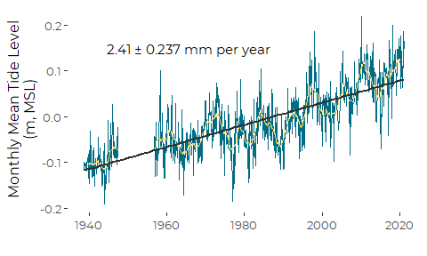

Graphics for Sea Level Rise at Providence, RI
================
Curtis C. Bohlen
March 31, 2021

-   [Introduction](#introduction)
-   [Import Libraries](#import-libraries)
-   [Import Data](#import-data)
-   [Estimating the Linear Trend](#estimating-the-linear-trend)
-   [Mimic the NOAA Graphic](#mimic-the-noaa-graphic)


# Introduction

Here we prepare a graphic for depicting local sea level rise in
Providence. All data is derived from NOAA Tides and Currents or COPS
data for the tide gauge in Providence, Maine. Since NOAA provides clean
data as monthly values, we need only plot NOAA data, with minimal
processing.

# Import Libraries

``` r
library(tidyverse)
#> -- Attaching packages --------------------------------------- tidyverse 1.3.0 --
#> v ggplot2 3.3.3     v purrr   0.3.4
#> v tibble  3.0.5     v dplyr   1.0.3
#> v tidyr   1.1.2     v stringr 1.4.0
#> v readr   1.4.0     v forcats 0.5.0
#> -- Conflicts ------------------------------------------ tidyverse_conflicts() --
#> x dplyr::filter() masks stats::filter()
#> x dplyr::lag()    masks stats::lag()
library(readr)

library(zoo)     # for the rollmean function
#> 
#> Attaching package: 'zoo'
#> The following objects are masked from 'package:base':
#> 
#>     as.Date, as.Date.numeric

library(nlme)    # for gls
#> 
#> Attaching package: 'nlme'
#> The following object is masked from 'package:dplyr':
#> 
#>     collapse

library(CBEPgraphics)

load_cbep_fonts()
```

# Import Data

Our primary source data is based on NOAA’s analysis of sea level trends.
The description on the source web site
(<https://tidesandcurrents.noaa.gov/datums.html?id=8454000>) says the
following, so this is apparently NOT raw data.

> “The plot shows the monthly mean sea level without the regular
> seasonal fluctuations due to coastal ocean temperatures, salinities,
> winds, atmospheric pressures, and ocean currents. … The plotted values
> are relative to the most recent Mean Sea Level datum established by
> CO-OPS.”

For convenience, we want to be able to report these elevations as
positive values, which makes it easier for readers to compare
elevations. NOAA uses a datum of MLLW for charting purposes. We follow
that practice here.

``` r
sibfldnm <- 'Original_Data'
parent <- dirname(getwd())
sibling <- file.path(parent,sibfldnm)

dir.create(file.path(getwd(), 'figures'), showWarnings = FALSE)
```

``` r
fn <- '8454000_meantrend.csv'

fpath <- file.path(sibling, fn)

slr_data  <- read_csv(fpath, 
    col_types = cols(Year   = col_integer(),
                     Month = col_integer(),
                     Monthly_MSL = col_double(),
                     Linear_Trend = col_double(),
                     High_Conf.  = col_double(),
                     Low_Conf.  = col_double()
                     )) %>%
  rename(MSL = Monthly_MSL) %>%
  mutate(theDate = as.Date(paste0(Year,'/', Month,'/',15)),
         before = Year < 1956) %>%
  mutate(MSL_ft = MSL *  3.28084)
#> Warning: 868 parsing failures.
#> row col  expected    actual                                                                                                file
#>   1  -- 6 columns 7 columns 'C:/Users/curtis.bohlen/Documents/Data Analysis/Providence-SLR/Original_Data/8454000_meantrend.csv'
#>   2  -- 6 columns 7 columns 'C:/Users/curtis.bohlen/Documents/Data Analysis/Providence-SLR/Original_Data/8454000_meantrend.csv'
#>   3  -- 6 columns 7 columns 'C:/Users/curtis.bohlen/Documents/Data Analysis/Providence-SLR/Original_Data/8454000_meantrend.csv'
#>   4  -- 6 columns 7 columns 'C:/Users/curtis.bohlen/Documents/Data Analysis/Providence-SLR/Original_Data/8454000_meantrend.csv'
#>   5  -- 6 columns 7 columns 'C:/Users/curtis.bohlen/Documents/Data Analysis/Providence-SLR/Original_Data/8454000_meantrend.csv'
#> ... ... ......... ......... ...................................................................................................
#> See problems(...) for more details.
```

# Estimating the Linear Trend

We use a linear model analysis to compare results to the linear trend
reported by NOAA on the source web page. NOAA reports the rate of sea
level rise in millimeters as 1.9 ± 0.14*m**m*/*y**r*.

The NOAA data are reported monthly, but to take advantage of the Date
class in R, we expressed monthly data as relating to the fifteenth of
each month.

As a result, our model coefficients are expressed in units per DAY. To
find the relevant annual rate of sea level rise, we need to multiply
both estimate (slope) and its standard error by 365.25 (approximate
length of a year in days) and then multiply again by 1000 to convert
from meters to millimeters.

The estimate from a simple linear model matches NOAA’s reported
estimate, but the standard error and derived 95% confidence interval are
considerably narrower. NOAA appropriately treated this as an
auto-correlated time series, instead of simply as a linear model. We do
the same, specifying and autoregressive error function of order 1.

``` r
the_gls <- gls(MSL~theDate, data=slr_data, correlation = corAR1())
ccs <- as.data.frame(summary(the_gls)$tTable)
EST <- round(ccs$Value[2] * 365.25 * 1000, 2)
SE <- round(ccs$Std.Error[2]   * 365.25 * 1000, 4)
CI <- 1.96*SE
tibble(Estimate = EST, Std_Err = SE, CI_95 =  CI)
#> # A tibble: 1 x 3
#>   Estimate Std_Err CI_95
#>      <dbl>   <dbl> <dbl>
#> 1     2.41   0.121 0.237
```

Those results match the NOAA-reported estimate and 95% confidence
interval.

# Mimic the NOAA Graphic

This a redrawing of the NOAA “Mean Sea Level Trend” graphic for
Providence. I have added a 24 month (2 year) moving average. This is not
ideal, as there is a gap in the data, and this graph eroneously connects
those points, but it’s a good start. \#\# In Meters

``` r
xloc = as.Date('1955-01-01')
annot <- paste(EST, '\U00B1', round(CI, 3), 'mm per year')

ggplot(slr_data, aes(theDate, MSL)) + 
  geom_line(aes(group = before), color=cbep_colors()[1]) +
  geom_line(aes(y=rollmean(MSL,24, na.pad=TRUE), group = before), color=cbep_colors()[2]) +
  geom_smooth(method='lm', se=FALSE, color=cbep_colors()[3]) + 
  annotate('text', label = annot, x = xloc, y = 0.15,  hjust = 0.25) +
  theme_cbep() + 
  xlab('') + 
  ylab('Monthly Mean Tide Level\n(m, MSL)') +
  theme_cbep(base_size = 12)
#> `geom_smooth()` using formula 'y ~ x'
#> Warning: Removed 23 row(s) containing missing values (geom_path).
```



``` r
 
ggsave('figures/providence_SLR.pdf', 
       device = cairo_pdf, width = 5, height = 3)
#> `geom_smooth()` using formula 'y ~ x'
#> Warning: Removed 23 row(s) containing missing values (geom_path).
```
